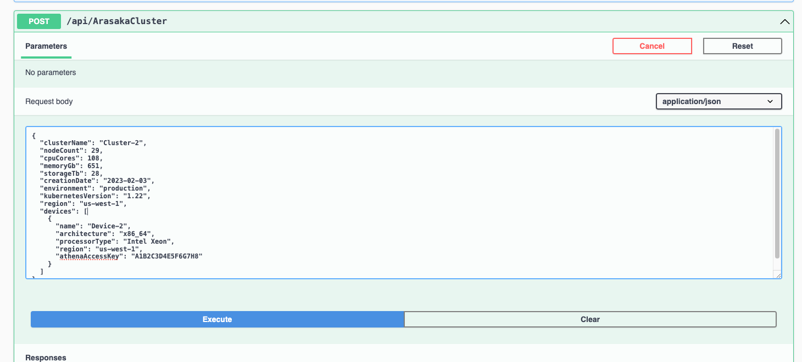

## Instructions
We already have most of the code for the ArasakaCluster but we need to hook up the new ArasakaDevice class/object to that cluster and setup the relationships. The DTOs (Data Transfer Objects) represent the structure for the data that's actually passing through HTTP. When our controller receives connections with JSON data as the payload then it will map those structures to the DTO, this ensures we map it correctly. The controller then maps this to the Database Model and continues from there.

For those above reasons we need you to do the following to make sure we can hook up the new ArasakaDevice to the cluster.
1. Fix the DTO so it works with our models and make sure our Database Models are hooked up together
    - Compare the models and make sure that each property of the database model also exists on the DTO. 
    - Make sure that our Database Models have properties so that EFCore knows our ArasakaDevice is associated with the cluster
    - The Cluster model probably needs something added...  

2. Make sure that we are creating tables for each of our Arasaka Models when a `dotnet ef database update` happens.
    - Maybe check the DbContext?
    - NOTE: we don't actually want to update the database here  
    
3. Make sure that the `OnModelCreating()` is validating that each ArasakaDevice has one cluster and that cluster also has many devices and the Device has a foreign key of clusterId and when deleted will Cascade.
    - HINT: it's a 1-to-many relationship 
    - Make sure that the arasaka device has the `.ValueGeneratedOnAdd()` in the `OnModelCreating()`  

4. Do the database migration and update. Try to test it with the sample payloads
    - To test it you can run your project, it should open Swagger. You can then use the POST option for ArasakaCluster.
    - You can use the SamplePosts.json in the `Models/Arasaka/` directory to test with. You can use one payload at a time, they should each work and return a 201 success code.  
    